<div align="center">

<!-- ═══════════════════════════════════════════════ -->
<!--  ✦ PREMIUM PROFILE BANNER — CLEAN & POWERFUL  -->
<!-- ═══════════════════════════════════════════════ -->

<!-- ✦ HERO: Custom animated SVG banner (Self-hosted) -->
[](https://github.com/syntax-savage)

<br/>

<!-- ✦ BADGES — Clean row with spacing -->
<a href="https://github.com/syntax-savage?tab=followers">
  
</a>
&nbsp;&nbsp;

&nbsp;&nbsp;
<a href="https://github.com/syntax-savage?tab=repositories">
  
</a>
&nbsp;&nbsp;


</div>

<br/>

<hr style="border: 0; border-top: 1px solid #302b63; margin: 15px 0; opacity: 0.3;" />

<br/>

##  About Me

```kotlin
// ⚡ Jimmy.kt — Main character loading...
data class Jimmy(
    val pronouns: String           = "He / Him",
    val alias: String              = "syntax-savage | DR.Code",
    val role: String               = "Full Stack Dev & Cloud Architect",
    val motto: String              = "I don't build apps. I build solutions.",
    val languages: List<String>    = listOf("Kotlin", "JavaScript", "Java", "Groovy", "SQL"),
    val mobile: List<String>       = listOf("Android", "Jetpack Compose", "KSP", "Room"),
    val cloud: List<String>        = listOf("AWS ☁️", "GCP 🌐", "Azure 🔷"),
    val tools: List<String>        = listOf("React", "Node.js", "Firebase", "Git", "Gradle"),
    val architecture: List<String> = listOf("microservices", "serverless", "MVVM", "Clean Arch"),
    val currentFocus: String       = "AI-powered apps that create real-world impact",
    val funFact: String            = "Napkin sketch → deployed app before lunch 🍕"
)

fun main() = Jimmy().also { println("Character unlocked: ${it.role}") }
```

<br/>

<div align="center">
  
</div>

<br/>

<hr style="border: 0; border-top: 1px solid #302b63; margin: 15px 0; opacity: 0.3;" />

<br/>

## 🛠️ Tech Arsenal

<div align="center">

<!-- Core skill icons — now with Kotlin & Jetpack Compose -->
<a href="https://skillicons.dev">
  
</a>

<br/><br/>

<table>
<tr>
<td width="50%">

### 🌐 Frontend & Web
<p align="left">
  
  
  
  
  
</p>

</td>
<td width="50%">

### ⚙️ Backend & Data
<p align="left">
  
  
  
  
  
</p>

</td>
</tr>

<tr>
<td width="50%">

### 🤖 Android & Kotlin Stack
<p align="left">
  
  
  
  
  
  
</p>

</td>
<td width="50%">

### ☁️ Cloud & DevOps
<p align="left">
  
  
  
  
</p>

</td>
</tr>
</table>

<!-- ✦ SPOTLIGHT: Kotlin & Compose Stack -->
<p align="center">
  <a href="https://kotlinlang.org/">
    
  </a>
  &nbsp;&nbsp;
  <a href="https://developer.android.com/jetpack/compose">
    
  </a>
  &nbsp;&nbsp;
  <a href="https://developer.android.com/training/data-storage/room">
    
  </a>
  &nbsp;&nbsp;
  <a href="https://kotlinlang.org/docs/ksp-overview.html">
    
  </a>
  &nbsp;&nbsp;
  <a href="https://gradle.org/">
    
  </a>
</p>

</div>

<br/>

<hr style="border: 0; border-top: 1px solid #302b63; margin: 15px 0; opacity: 0.3;" />

<br/>

##  Featured Projects

<div align="center">
  <i>🎯 Every project below was built to solve a real-world problem.</i>
</div>

<br/>

<!-- Project 1: SignalRepair -->
<table>
<tr>
<td width="100%">

### <a href="https://github.com/syntax-savage/signalrepair"></a>

> #### *"Predict signal failures before they happen."*

💡 **The Problem:** Dropped calls and dead Wi-Fi zones plague millions daily. Users only realize their connection is failing *after* it's already gone — leading to lost work, missed calls, and frustration.

🚀 **The Solution:** SignalRepair continuously collects cellular & Wi-Fi telemetry, predicts signal deterioration using trend analysis, and provides **AI-generated troubleshooting recommendations** before failures occur.

<details>
<summary>🔍 <b>View Details</b></summary>
<br/>

| Feature | Description |
|:---|:---|
| 📊 Real-Time Telemetry | Continuous cellular & Wi-Fi signal strength monitoring |
| 🔮 Predictive Analysis | Trend-based signal deterioration prediction engine |
| 🤖 AI Troubleshooting | AI-generated fix recommendations before failure |
| 📈 Signal History | Historical signal maps and performance analytics |

**Tech:** `Kotlin 2.0` · `Jetpack Compose` · `Room DB` · `ML Kit`

[](https://github.com/syntax-savage/signalrepair)

</details>

</td>
</tr>
</table>

<!-- Project 2: BharatOne -->
<table>
<tr>
<td width="100%">

### <a href="https://github.com/syntax-savage/BharatOne1"></a>

> #### *"Bridging citizens and public safety — one tap at a time."*

💡 **The Problem:** In emergencies, citizens struggle to reach the right authorities quickly. Fragmented government helplines and lack of unified reporting leads to delayed response times.

🚀 **The Solution:** BharatOne is a secure, state-of-the-art Android application engineered to bridge the gap between citizens and public safety administration — built as a high-performance solution for the Government.

<details>
<summary>🔍 <b>View Details</b></summary>
<br/>

| Feature | Description |
|:---|:---|
| 🚨 Emergency SOS | One-tap emergency alert with GPS location sharing |
| 📋 Incident Reporting | Structured, categorized report filing with media attach |
| 🗺️ Live Tracking | Real-time GPS tracking for emergency responders |
| 🔐 Secure Auth | Government-grade security with encrypted communications |

**Tech:** `Kotlin 2.0` · `Jetpack Compose` · `Firebase` · `Google Maps API`

[](https://github.com/syntax-savage/BharatOne1)

</details>

</td>
</tr>
</table>

<!-- Project 3: Craving.lol -->
<table>
<tr>
<td width="100%">

### <a href="https://github.com/syntax-savage/Craving.lol"></a>

> #### *"Tell it what you're craving. Get roasted by AI. Find it anyway."*

💡 **The Problem:** Food discovery apps are boring and predictable. They lack personality, engagement, and the fun factor that keeps users coming back.

🚀 **The Solution:** An unhinged, dark-themed Android app that brutally roasts your food cravings with AI-powered humor — then finds the nearest spot to satisfy them anyway. Powered by **Groq LLM, ElevenLabs TTS**, and OpenStreetMap.

<details>
<summary>🔍 <b>View Details</b></summary>
<br/>

| Feature | Description |
|:---|:---|
| 🤖 AI Roast Engine | Groq LLM generates savage, hilarious roasts for your cravings |
| 🗣️ Voice Roasts | ElevenLabs TTS reads roasts aloud with personality |
| 🗺️ Nearby Finder | OpenStreetMap integration to locate food spots |
| 🌙 Dark Theme | Premium dark-themed UI with smooth animations |

**Tech:** `Kotlin` · `Jetpack Compose` · `Groq LLM` · `ElevenLabs TTS` · `OpenStreetMap`

[](https://github.com/syntax-savage/Craving.lol)

</details>

</td>
</tr>
</table>

<!-- Project 4: Melofy -->
<table>
<tr>
<td width="100%">

### <a href="https://github.com/syntax-savage/melofy"></a>

> #### *"The cyberpunk music experience you didn't know you needed."*

💡 **The Problem:** Mainstream music apps look generic and feel uninspired. The streaming experience hasn't evolved visually in years.

🚀 **The Solution:** Melofy is a futuristic, premium **Cyberpunk music and podcast streaming** Android app built with Jetpack Compose — featuring a stunning glassmorphic UI, low-latency audio playback, and dynamic YouTube podcast integration.

<details>
<summary>🔍 <b>View Details</b></summary>
<br/>

| Feature | Description |
|:---|:---|
| 🎨 Glassmorphic UI | Stunning cyberpunk-themed glassmorphism design |
| ⚡ Low-Latency Audio | High-performance audio engine for seamless playback |
| 🎙️ Podcast Streaming | Dynamic YouTube podcast integration |
| 🌈 Visual Equalizer | Real-time audio visualization with cyberpunk aesthetics |

**Tech:** `Kotlin 2.0` · `Jetpack Compose` · `ExoPlayer` · `YouTube API`

[](https://github.com/syntax-savage/melofy)

</details>

</td>
</tr>
</table>

<!-- Project 5: Walkie-Talkie -->
<table>
<tr>
<td width="100%">

### <a href="https://github.com/syntax-savage/-Walkie-Talkie-App-Native-Android-P2P-Voice-Communicator"></a>

> #### *"Real-time voice. Zero internet. Pure connection."*

💡 **The Problem:** Communication in areas with no cellular or Wi-Fi coverage is nearly impossible with standard apps. Emergency scenarios, outdoor adventures, and industrial sites need offline voice solutions.

🚀 **The Solution:** A native Android **peer-to-peer voice communicator** enabling instant real-time audio streaming — operating fully offline using local Bluetooth RFCOMM sockets with crystal-clear audio.

<details>
<summary>🔍 <b>View Details</b></summary>
<br/>

| Feature | Description |
|:---|:---|
| 📡 Bluetooth P2P | Direct device-to-device communication via RFCOMM |
| 🔇 Offline Mode | Zero internet dependency — works anywhere |
| 🎙️ Crystal Audio | High-quality audio capture and streaming |
| ⚡ Low Latency | Near-instant push-to-talk response time |

**Tech:** `Kotlin` · `Android Bluetooth API` · `RFCOMM` · `AudioRecord`

[](https://github.com/syntax-savage/-Walkie-Talkie-App-Native-Android-P2P-Voice-Communicator)

</details>

</td>
</tr>
</table>

<!-- Project 6: WriteRight AI -->
<table>
<tr>
<td width="100%">

### <a href="https://github.com/syntax-savage/WriteRight-AI-"></a>

> #### *"Your AI writing assistant — everywhere you type."*

💡 **The Problem:** Writers context-switch between their work and separate AI tools constantly. Copy-pasting between apps kills flow and creativity.

🚀 **The Solution:** WriteRight AI is a premium browser extension that injects a writing assistant **directly beside your cursor** in every text field, textarea, and contenteditable frame on the web.

<details>
<summary>🔍 <b>View Details</b></summary>
<br/>

| Feature | Description |
|:---|:---|
| 🎯 Inline Assist | AI suggestions appear right at your cursor position |
| 🌐 Universal Support | Works in every text field across the entire web |
| ⚡ Real-Time | Instant suggestions with zero page reload |
| 🎨 Clean UI | Minimal, non-intrusive design that blends with any site |

**Tech:** `JavaScript` · `Chrome Extension (MV3)` · `AI/ML API`

[](https://github.com/syntax-savage/WriteRight-AI-)

</details>

</td>
</tr>
</table>

<!-- Project 7: SpeedUp -->
<table>
<tr>
<td width="100%">

### <a href="https://github.com/syntax-savage/SpeedUp-v1.0"></a>

> #### *"Control every video. Any speed. Any site."*

💡 **The Problem:** Browser-native video speed controls are limited and clunky. Most sites cap at 2x, and there's no way to fine-tune playback across tabs.

🚀 **The Solution:** SpeedUp is a **Manifest V3 Chrome extension** for advanced HTML5 video speed control — play any video from 0.25x to 16x with smart pitch handling, Shadow DOM support, per-tab isolation, and a sleek dark UI.

<details>
<summary>🔍 <b>View Details</b></summary>
<br/>

| Feature | Description |
|:---|:---|
| ⚡ 0.25x–16x Range | Ultra-wide speed control for any HTML5 video |
| 🎵 Smart Pitch | Pitch-corrected audio at any playback speed |
| 🌑 Shadow DOM | Works on sites using Shadow DOM (YouTube, Netflix) |
| 🖥️ Per-Tab Isolation | Independent speed settings for each browser tab |

**Tech:** `JavaScript` · `Chrome Extension (MV3)` · `Web Audio API`

[](https://github.com/syntax-savage/SpeedUp-v1.0)

</details>

</td>
</tr>
</table>

<!-- Project 8: LoanWise -->
<table>
<tr>
<td width="100%">

### <a href="https://github.com/syntax-savage/loanwise"></a>

> #### *"Pay off student loans smarter, not harder."*

💡 **The Problem:** Millions of students drown in loan debt because they lack tools to create optimized repayment strategies. Complex interest calculations lead to thousands in unnecessary overpayment.

🚀 **The Solution:** LoanWise analyzes loan terms, interest rates, and repayment options to generate **AI-optimized payoff strategies** — saving users thousands of dollars and years of stress.

<details>
<summary>🔍 <b>View Details</b></summary>
<br/>

| Feature | Description |
|:---|:---|
| 📊 Smart Repayment Calculator | AI-driven calculation of the fastest & cheapest payoff path |
| 🔄 Loan Comparison Engine | Side-by-side loan comparison with visual breakdowns |
| 📈 Personalized Timeline | Dynamic payoff timeline based on user's financial profile |
| 💰 Savings Dashboard | Real-time tracker showing money saved vs. standard repayment |

**Tech:** `React` · `Node.js` · `Firebase` · `SQL` · `Chart.js`

[](https://github.com/syntax-savage/loanwise)

</details>

</td>
</tr>
</table>

<!-- Project 9: G-A-I-A -->
<table>
<tr>
<td width="100%">

### <a href="https://github.com/syntax-savage/G-A-I-A"></a>

> #### *"AI-powered insights to predict where help is needed most."*

💡 **The Problem:** Billions in humanitarian aid are wasted annually due to poor allocation. Resources go where cameras are pointing, not where they're needed most.

🚀 **The Solution:** G-A-I-A uses **predictive AI and data analytics** to identify at-risk communities *before* disaster strikes — helping NGOs and donors allocate resources with surgical precision.

<details>
<summary>🔍 <b>View Details</b></summary>
<br/>

| Feature | Description |
|:---|:---|
| 🗺️ Predictive Need-Mapping | AI forecasts where aid will be needed in 30/60/90 days |
| 🌍 Real-Time Tracking | Live disaster and crisis monitoring with alert system |
| 🤝 Donor Matching | Connects donors with causes aligned to their values |
| 📊 Impact Analytics | Post-aid measurement showing real outcomes, not just spend |

**Tech:** `React` · `Node.js` · `Azure` · `Firebase` · `ML Models`

[](https://github.com/syntax-savage/G-A-I-A)

</details>

</td>
</tr>
</table>

<!-- Project 10: NullByte -->
<table>
<tr>
<td width="100%">

### <a href="https://github.com/syntax-savage/NullByte"></a>

> #### *"Zero in on bugs. Zero tolerance for broken code."*

💡 **The Problem:** Developers spend up to 50% of their time debugging. Traditional tools are clunky, fragmented, and require constant context-switching.

🚀 **The Solution:** NullByte provides an **intelligent debugging and code analysis toolkit** that helps developers identify, understand, and fix issues faster — turning hours of debugging into minutes.

<details>
<summary>🔍 <b>View Details</b></summary>
<br/>

| Feature | Description |
|:---|:---|
| 🔍 Smart Error Analysis | AI-powered root cause analysis for faster debugging |
| 📊 Code Health Dashboard | Visual overview of code quality metrics and trends |
| 🧪 Automated Testing | Intelligent test generation for edge cases |
| ⚡ Quick Fixes | One-click suggested fixes for common issues |

**Tech:** `JavaScript` · `Node.js` · `Git` · `AI/ML`

[](https://github.com/syntax-savage/NullByte)

</details>

</td>
</tr>
</table>

<br/>

<hr style="border: 0; border-top: 1px solid #302b63; margin: 15px 0; opacity: 0.3;" />

<br/>

## 📊 GitHub Analytics

<div align="center">


<br/><br/>

[](https://git.io/streak-stats)

</div>

<br/>

## 🏆 Trophies

<div align="center">

[](https://github-profile-trophy.vercel.app/?username=syntax-savage)

</div>

<br/>

<hr style="border: 0; border-top: 1px solid #302b63; margin: 15px 0; opacity: 0.3;" />

<br/>

## 🤝 Let's Build Something Together

<div align="center">

[](https://github.com/syntax-savage)

<br/><br/>

### 💬 Random Dev Quote
[](https://github.com/piyushsuthar/github-readme-quotes)

<br/>

<!-- Snake Animation -->
<picture>
  <source media="(prefers-color-scheme: dark)" srcset="https://raw.githubusercontent.com/syntax-savage/syntax-savage/output/github-contribution-grid-snake-dark.svg" />
  <source media="(prefers-color-scheme: light)" srcset="https://raw.githubusercontent.com/syntax-savage/syntax-savage/output/github-contribution-grid-snake.svg" />
  
</picture>

</div>

<br/>

<!-- Premium Animated Footer -->

